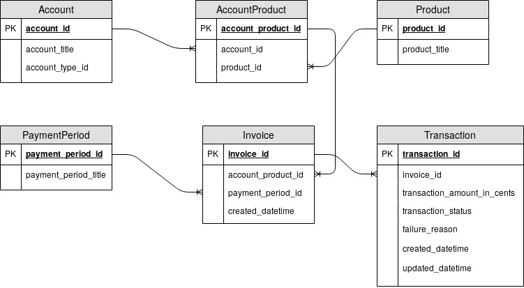

Our company, Business of Fashion, offers a subscription-based service. We offer two different products ("membership" and "careers"), which our clients can pay the subscription for either on monthly or yearly basis.

We sell the two products to two types of clients: individuals and organisations. In both cases, when a client decides to subscribe, they get an account in our database. For each subscription period, we create an invoice, and bill clients recurringly (either on yearly or monthly basis). Each invoice may involve multiple transactions, especially if payment fails. In case of payment failure on renewal, we do not want to cut the client out immediately, but offer them a grace period of 7 days to pay for the currently active period. When such an event occurs (client's subscription within a grace period), we say that subscription has gone into "dunning" state. When the grace period elapses, a dunning subscription transitions to either successfully renewed or unsuccessfully renewed (also called "churned").

The simple data model we use can be represented with the following ER diagram:

For business purposes, a product manager, would like to understand retention of our clients. Your job is to design a dashboard with appropriate visualizations (one or more) which will enable them to succinctly understand renewal rates for a given time period.

The minimal viable solution should enable them to:

- aggregate data with different time periods (daily, monthly, ...)
- filter data by payment type and account type
- for each time period, see how many subscriptions are/were:
    + expected to renew,
    + successfully renewed,
    + unsuccessfully renewed (have churned),
    + gone dunning (payment was unsuccessfuly, but subscription is still within the grace period).

It is up to you to determine the appropriate type of visualization needed to present the required data. For assignment purposes, we will not require you to implement the visualization in any specific tool or technology. Pick whatever seems to be the best way to represent the possible solution (paper and pencil are fast and easy way to do that in short amount of time).

Think about other insights the data could give us. What do you think product manager would also be interested in and how would you present that? You are not exclusively limited by the data model we have and the data we've collected. On your request, we might be able to collect additional data if that is needed, but comminicate that appropriately.

While we do not require you to actually implement the visualization, we'd like to see how you'd approach to aggregating data which we could put into a visualization tool to produce the actual dashboard. In other words, we'd like to see the queries used on the data. If you do not manage to write queries for full solution, we'd at least like to see the steps and methods used to extract the data, step by step. If it feels necessary, you may propose or create additional tables. Access to database will be provided in person on-site.

The solution should be sumitted to the original repository in form of pull-request. In case the solution includes any non-digital material, we'll collect it manually.

